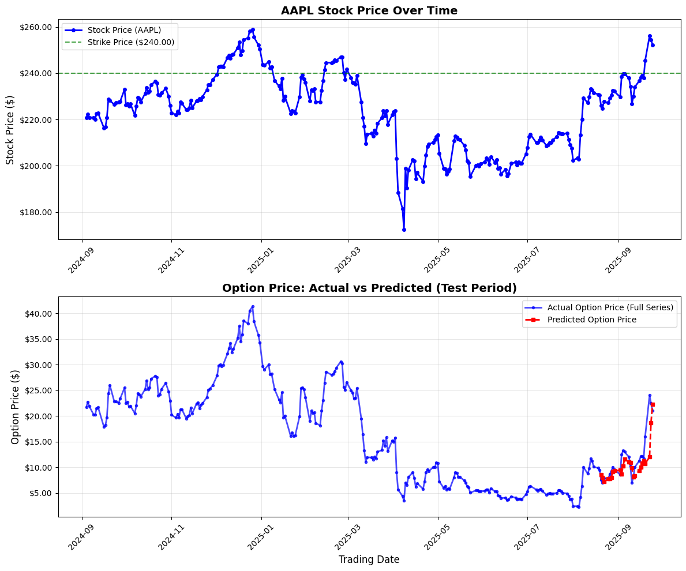
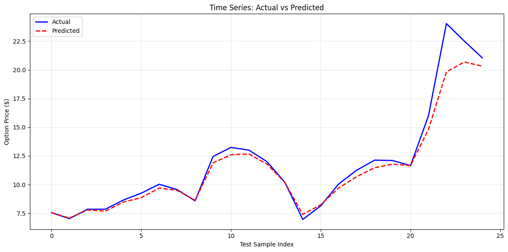

# ConvLSTM Option Price Prediction Model

## Overview

This project implements a Convolutional LSTM (ConvLSTM) model for predicting option prices using historical data from the Polygon API. The model combines convolutional layers for spatial feature extraction (e.g., stock price, time-to-maturity, strike price, implied volatility) with LSTM layers for temporal modeling of option price sequences.

The notebook (`LSTM.ipynb`) demonstrates:
- Data fetching and preparation for a specific AAPL call option (symbol: `AAPL251219C00240000`, expiration: December 19, 2025, strike: $240).
- Implied volatility calculation using the Black-Scholes model and Brent's method for root finding.
- Model architecture, training, and evaluation.
- Visualization of stock prices, actual vs. predicted option prices, and data validation.

Key features:
- Uses PyTorch for the neural network.
- Handles sequence data with a sliding window approach (sequence length: 15 days).
- Trains on 90% of the data and tests on the remaining 10%.
- Focuses on predicting option prices for the test period (e.g., August 20, 2025, to September 24, 2025, based on sample output).

## Requirements

- Python 3.12+
- Libraries:
  - torch
  - numpy
  - scipy
  - pandas
  - matplotlib
  - polygon-api-client (for data fetching)
  - scikit-learn

## Setup

1. **API Key**: The notebook uses a Polygon API key for data fetching. Replace the hardcoded key (`XN1r3nHQ1Rb3SsbqdwDI72dE35vJkCzP`) with your own. Sign up for a free API key at [polygon.io](https://polygon.io).

2. **Environment**: Run in a Jupyter environment (e.g., Jupyter Notebook or JupyterLab). Ensure CUDA is available if using GPU for training.

3. **Data Range**: Data is fetched from September 1, 2024, to September 25, 2025. Adjust `from_date` and `to_date` as needed. Note: The current date in the context is September 26, 2025, so data up to the previous day is used.

## Outcome Display

## Usage

1. **Run the Notebook**:
   - Open `LSTM.ipynb` in Jupyter.
   - Execute cells sequentially.
   - The data fetching cell may take time depending on API limits (up to 50,000 results).

2. **Key Sections**:
   - **Data Preparation**: Implements Black-Scholes for implied volatility and fetches OHLCV data for the option and underlying stock (AAPL).
   - **Dataset Construction**: Creates a Pandas DataFrame with columns: `Trading_Date`, `TTM_Days`, `Stock_Price`, `Strike_Price`, `implied_vol`, `Option_Price`, `imp_vol_last` (lagged implied volatility).
   - **Model Training**: Defines ConvLSTM architecture, splits data (90/10 train/test), trains for up to 10,000 epochs with early stopping.
   - **Visualization**: Plots AAPL stock price over time (with strike line) and actual vs. predicted option prices for the test period.
   - **Validation**: Prints dataset stats, test period details, and sample predictions for verification.

3. **Customization**:
   - Change `option_symbol` to analyze other options (e.g., different strikes or expirations).
   - Adjust hyperparameters: `SEQUENCE_LENGTH=15`, `HIDDEN_SIZE=64`, `NUM_LAYERS=2`, `BATCH_SIZE=64`, `NUM_EPOCHS=10000`.
   - For delta prediction (to fix lagging issues): Modify the sequence creation function as suggested in related discussions.

## Data Source

- **Polygon API**: Daily aggregates for option and stock prices.
- **Dataset Size**: Approximately 262 rows (after cleaning), covering trading days from late 2024 to September 2025.
- **Features**:
  - Convolutional inputs: Stock_Price, TTM_Days, Strike_Price, imp_vol_last.
  - LSTM inputs: Historical Option_Price sequences.
  - Target: Future Option_Price (or deltas for improved forecasting).

## Model Details

- **Architecture**: ConvLSTMOptionPrice class with 3 Conv1D layers, batch norm
